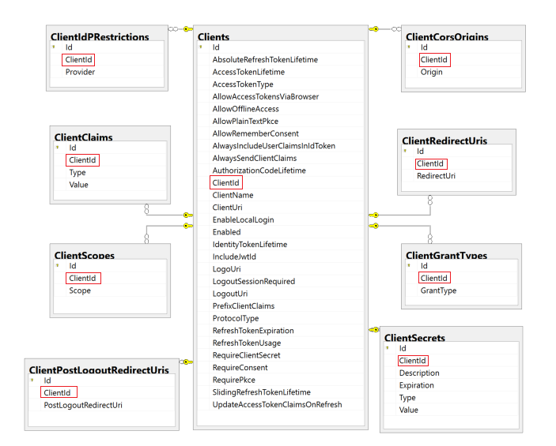
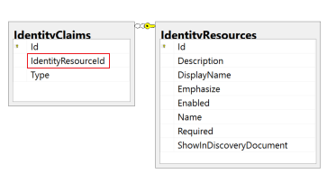
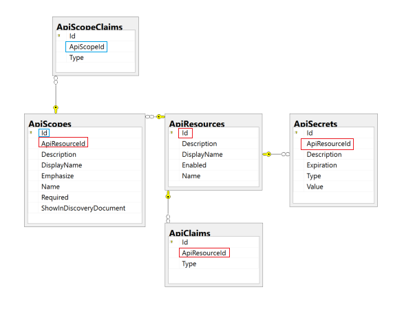
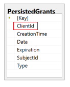

Database Diagram: IdentityServer4 Database
==========================================

The ID4 QuickStart applications demonstrate how to configure Authentication Flow by Client Application via the ASP.Net Core Startup.cs class. The other way to configure Authentication Flow for each of your Client Applications is via ID4 Database Customization.

Client App Related Tables
-------------------------

The Client App Related Tables support the Authorization Flows for the various client applications considered in this project. 

**Clients**

Data in this table defines which Client Applications have access to the ID4 server and what some of the properties of that acess are.

**ClientClaims**

**ClientScopes**

**ClientCorsOrigins**

Data in this table defines CORS settings when the ID4 server has a different Subdomain than the Client Application.  The records specify which Cross Domains are allowed to contact the ID4 server.

IdentityResources Related Tables
--------------------------------

There is no configuration data in these tables at this time.

Api Resources Related Tables
----------------------------

Persisted Grant Table
---------------------

There are no configuration records in the Persisted Grant table. These represent the tokens created as they are granted and updated when they are revoked.

